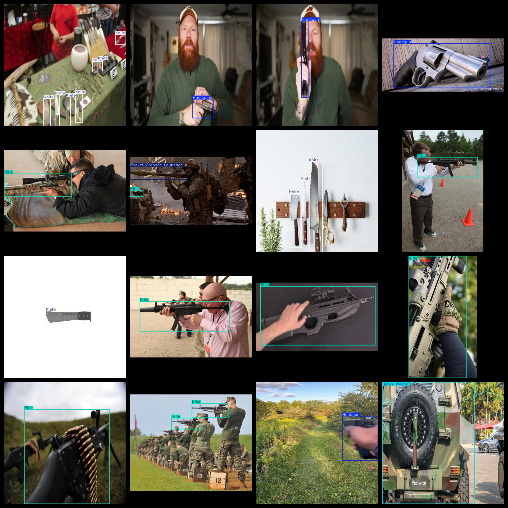
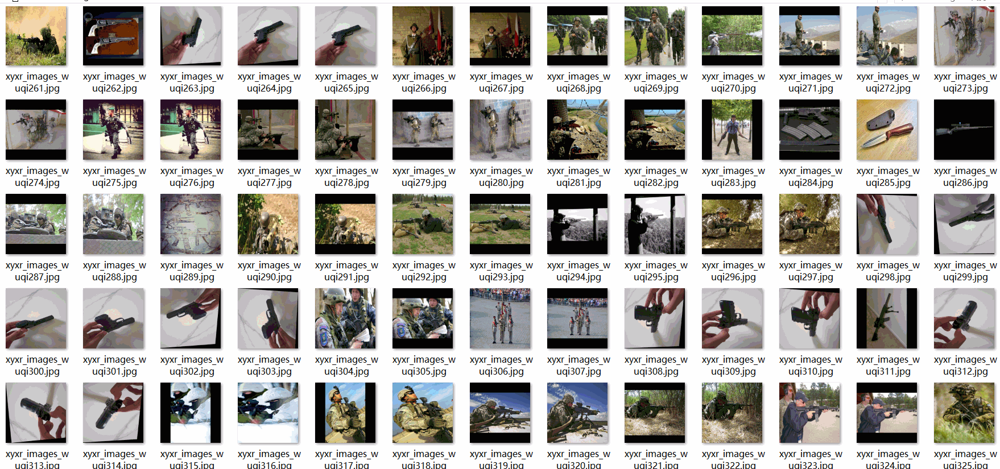

# 5 typesWeapon Dataset 28260 imagesVOC+YOLO format

5 weapon datasets 28260 VOC + YOLO format

Dataset format: Pascal VOC format + YOLO format (the txt file does not contain the split path, it only contains jpg images and corresponding VOC format xml files and yolo format txt files)

Number of images (jpg file count): 28,260

Number of xml files: 28,260

Marked quantity (number of txt files): 28260

Number of callout categories: 5

The Github repository is: datasets_sl

["Handgun", "Heavy Weapon", "Knife", "Rifle", "Rocket_Grenade Launcher"]

Labels Chinese Translation: Pistol, Heavy Weapons, Knife, Rifle, Rocket/Grenade Launcher

Number of boxes labeled in each category:

Handgun frame count = 6372

Heavy Weapon Frame Count = 2554

Knife frame count = 10769

Rifle frame count = 12252

Rocket_Grenade_Launcher_Frames = 2144

Total Frames: 34091

Number of images per category:

Handgun ownership count = 5486

Heavy Weapon occupancy picture count = 2315

Knife's possession of image count = 8894

Rifle occupies 10099 pictures

Rocket_Grenade_Launcher_Occupies = 2064

Image resolution: 640x640

Use the labeling tool: labelImg

Dataset Augmentation: Yes

Rules for annotation: Draw a rectangle around the category.

Important note: The dataset does not have been divided into training, validation, and testing sets.

Special Disclaimer: This dataset does not guarantee the accuracy of the trained models or weight files.

Annotation and image details are as follows:

## Images

---

Here is a pay link on Stripe (https://buy.stripe.com/3cs8yP7sY87d0vu9AB). Please contact me lonlonago@foxmail.com after funding $89, and I will send you a complete data files, thank you!

